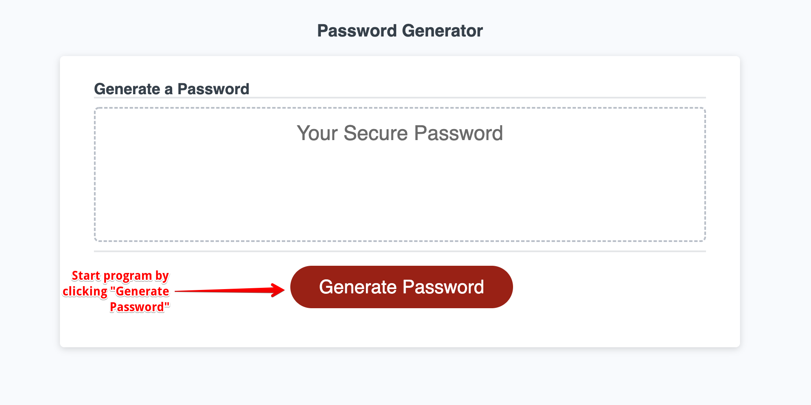
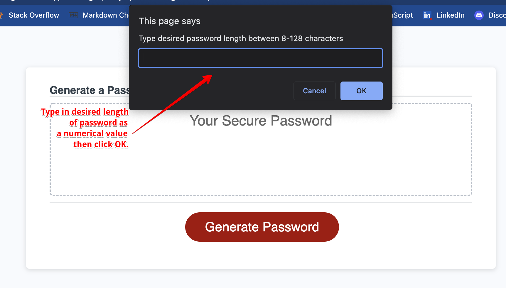
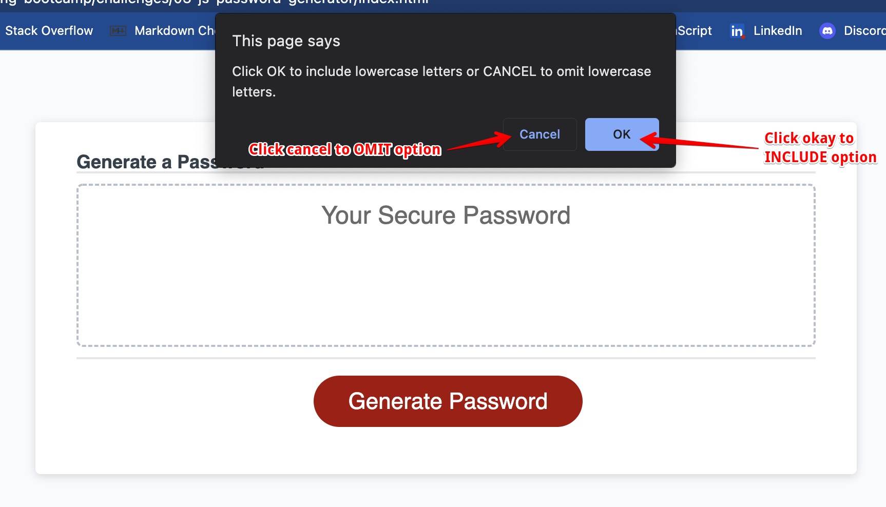
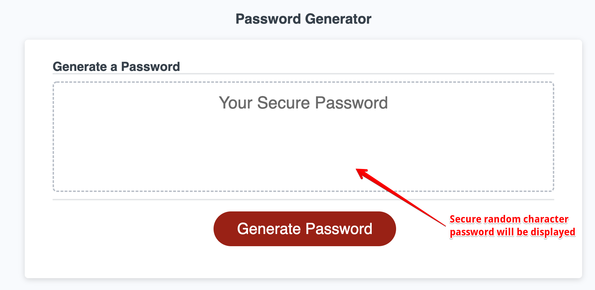

# JavaScript Password Generator

## Deployed Website

[JavaScript Password Generator](https://missatrox44.github.io/js-password-generator)

## Description
This JS app was created to randomly generate a password that meets certain criteria. This strong password provides greater security against access to sensitive data.

## Table of Contents
- [Resources](#Resources)  
- [Usage](#Usage)
- [License](#License)
- [Contributing](#Contributing)
- [Questions](#Questions)

## Resources

* reset.css file reproduced from UT Austin Bootcamp Curriculum. 
* For loop modified from [Foolish Developer](https://dev.to/code_mystery)
* Starter HTML & CSS code provided by UT Austin Bootcamp Curriculum

## Usage
Go to deployed website and click the "Generate Password" button to start the program.
  
Enter desired length of password between 8-128 then click OK. Any numerical values outside of this range will end prompts and user will have to start over.
  
User will be asked to include lowercase letters, uppercase letters, numbers and special characters. User must click OK to include these characters or CANCEL to omit characters.
  
A randomly generated password will be displayed in the box with the dashed border. 
  

## License
MIT

## Contributing
[Sara Baqla](https://github.com/missatrox44)  
[Jeffrey Littleton](https://github.com/littletonjeffrey) 
[Aaron Anglin](https://github.com/aanglin)

## Questions
Github username: [missatrox44](https://github.com/missatrox44)  
Email: missatrox44@gmail.com

